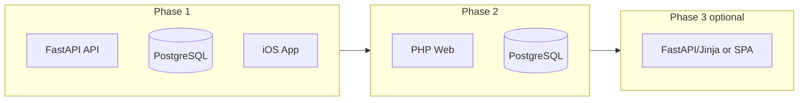

# Malfunction DZ: PHP/MySQL to Python/FastAPI/PostgreSQL Migration Plan

## Current State Summary

| Layer              | Current                                                                  | Scope                                                                                                       |
| ------------------ | ------------------------------------------------------------------------ | ----------------------------------------------------------------------------------------------------------- |
| **Client**         | Swift/SwiftUI iOS app                                                    | Unchanged (points to new API)                                                                               |
| **API**            | 41 PHP endpoints in `platform/app/public/api/`                           | ~50 endpoints total (some iOS-called are not yet built)                                                     |
| **Web dashboards** | PHP (ops, loft, lms, aircraft) ~90 views + controllers                   | Server-rendered MVC                                                                                         |
| **Database**       | MySQL 8                                                                  | ~30 tables, migrations in `platform/app/database/` and `platform/db/` |

**Estimated effort**: ~48k LOC PHP backend, ~15k LOC Swift client, 29 SQL migrations.

---

## Feasibility: Yes, Very Doable

- No production traffic; switching now is ideal
- API contract is well-defined (`{ok, data?, error?}` JSON + Bearer auth)
- iOS only needs `kServerURL` updated
- Business logic is mostly CRUD + joins; no exotic PHP features

---

## Staged vs All-at-Once

### Recommendation: **Staged (3 phases)**

Doing it all at once increases risk and makes debugging harder. A staged approach lets you validate each phase before moving on.



---

## Phase 1: API + Database (Core migration)

**Goal**: FastAPI serves all API endpoints; PostgreSQL holds all data; iOS talks to FastAPI.

### 1.1 PostgreSQL schema

- Convert 29 MySQL migrations to PostgreSQL
- Main changes: `ENUM` → PostgreSQL `CREATE TYPE` or `VARCHAR` CHECK, `TINYINT(1)` → `BOOLEAN`, `INT UNSIGNED` → `INTEGER`, `AUTO_INCREMENT` → `SERIAL`/`GENERATED`, `DATETIME` → `TIMESTAMP`, drop `ENGINE`/`CHARSET`
- Use Alembic for migrations going forward

### 1.2 FastAPI project layout

```
platform-py/
  app/
    main.py              # FastAPI app, CORS, routers
    config.py            # DB URL, env
    db.py                # async SQLAlchemy/asyncpg
    auth.py              # Bearer validation, dependency
    routers/
      auth.py            # POST /api/login
      me.py              # GET /api/me
      config.py          # GET /api/config
      users.py            # /api/users, /api/user, /api/user_roles, /api/roles
      lms/                # courses, lesson, quiz, logbook, signoff, rigs, etc.
      aircraft/
      flights/
      loft/
      pilots/
      push/
      weather/
    models/              # SQLAlchemy ORM
    schemas/             # Pydantic request/response
```

### 1.3 Endpoint parity (preserve URLs for iOS)

Keep the same paths so the iOS app works without changes (except base URL). Map PHP endpoints as follows:

| Domain      | Endpoints to implement |
| ----------- | ---------------------------------------------------------------------------------------------------------------------------------------------------------------------------------------- |
| Auth        | `login`, `me` |
| Config      | `config` (no auth) |
| Users       | `users`, `user`, `user_roles`, `roles`, `user_send_reset` |
| LMS         | `courses`, `my_courses`, `lesson`, `complete`, `signoff`, `quiz`, `pending_signoffs`, `logbook`, `logbook_add`, `logbook_sign`, `logbook_settings`, `rigs`, `rig_catalog`, `auto_enroll` |
| LMS manage* | `manage_courses`, `manage_course`, `manage_modules`, etc. (called by LMSEditService; build in FastAPI) |
| Aircraft    | `list`, `logbook`, `squawks`, `ads`, `summary`, `flights`, `flight_start`, `flight_close`, `load_add`, `load_delete`, `logbook_entry` |
| Flights     | `today`, `my_flights` |
| Loft        | `list`, `dz_rigs` |
| Pilots      | `profile`, `upload`, `list` |
| Push        | `register`, `notifications` |
| Weather     | `metar` |
| Calendar**  | `events`, `shifts`, `shift_claim`, `shift_request_release` |
| DZ          | `status` |
| Users       | `jump_check` |

\* Not present in PHP; build in FastAPI  
\** From `docs/IOS_CALENDAR_SHIFTS_PROMPT.md`; may need backend tables

### 1.4 Auth and integrations

- **Auth**: Bearer token from `api_tokens`; same flow as `AuthController.php`
- **METAR**: Proxy to `aviationweather.gov`
- **Push**: Keep device token registration; APNs sending can stay as a small script or move to Python (e.g. `apns2`)
- **Email**: Replace `mailer.php` with something like `fastapi-mail` or an external provider

### 1.5 Data migration

- Export MySQL (structure + data)
- Import into PostgreSQL (manual or pgloader)
- Validate foreign keys and sample queries

### 1.6 iOS change

- Update `kServerURL` in `Foundation.swift` to the new FastAPI base URL
- No other client code changes if responses are identical

**Phase 1 effort**: ~2–4 weeks (depending on missing endpoints like calendar, dz_rigs, manage_*, jump_check).

---

## Phase 2: Web dashboards on PostgreSQL

**Goal**: Existing PHP web apps (ops, loft, lms, aircraft) use PostgreSQL instead of MySQL.

- Change `platform/app/shared/lib/db.php` to use PDO PostgreSQL (`pgsql:host=...`)
- Ensure MySQL-specific SQL is updated (e.g. `LIMIT` is fine; `ON DUPLICATE KEY` needs `ON CONFLICT`)
- Run both systems in parallel during testing, then cut over

**Phase 2 effort**: ~3–5 days (mostly SQL compatibility and testing).

---

## Phase 3 (optional): Replace PHP web with FastAPI

**Goal**: Remove PHP; serve web dashboards from FastAPI.

**Options**:
- **A**: FastAPI + Jinja2 templates (similar to current PHP MVC)
- **B**: FastAPI API only + React/Vue SPA
- **C**: Keep PHP dashboards long-term if they work fine on PostgreSQL

**Phase 3 effort**: ~2–4 weeks per app area if doing full rewrite.

---

## Work Estimate Summary

| Phase   | Scope                                     | Effort    |
| ------- | ----------------------------------------- | --------- |
| Phase 1 | FastAPI API + PostgreSQL + data migration | 2–4 weeks |
| Phase 2 | PHP dashboards on PostgreSQL              | 3–5 days  |
| Phase 3 | Replace web dashboards (optional)         | 2–4 weeks |

**Minimum to ship**: Phase 1 + Phase 2 ≈ **3–5 weeks**.

---

## Side-by-Side Setup (Recommended)

**Yes — keep the PHP/MySQL copy fully working.** Do not modify it. Build the new stack in parallel.

### Layout

```
MalfunctionDZ/
├── MalfunctionDZ/          # iOS app (unchanged)
├── platform/              # PHP + MySQL — LEAVE AS-IS, keep running
└── platform-py/           # NEW: FastAPI + PostgreSQL
    ├── app/
    ├── docker-compose.yml
    ├── requirements.txt
    └── .env
```

- **PHP** (MAMP or Docker): stays on port 8080 or 8888
- **FastAPI**: runs on port 8000 (or 8081)
- **PostgreSQL**: separate container (e.g. port 5433) — never touches MySQL

### Why Side-by-Side

- PHP remains the reference implementation; you can always fall back
- Test endpoints by comparing PHP vs FastAPI responses
- Switch iOS between backends by changing `kServerURL` for testing
- No risky migrations until FastAPI is ready

### Getting Started (First Session)

1. **Create `platform-py/`** alongside `platform/` with minimal FastAPI + PostgreSQL Docker setup
2. **Convert 1–2 core tables** (e.g. `platform_users`, `api_tokens`) to PostgreSQL
3. **Implement 3 endpoints**: `POST /api/login.php`, `GET /api/me.php`, `GET /api/config.php` — keeping `.php` in the path so iOS URLs work
4. **Point iOS** at `http://localhost:8000` (or your FastAPI URL), run a login flow
5. Then add endpoints incrementally (users, LMS, aircraft, etc.)

### Switch iOS Between Backends

In `Foundation.swift`, change `kServerURL`:

```swift
// PHP (current)
let kServerURL = "http://localhost:8888"   // or "http://51.81.210.212:8080"

// FastAPI (when testing)
let kServerURL = "http://localhost:8000"
```

For Simulator, `localhost` works. For a physical device, use your machine's LAN IP (e.g. `http://192.168.1.x:8000`).

### Development on Windows (Docker)

You can build the FastAPI backend on a Windows laptop with Docker — no Mac or iOS needed. Test with FastAPI's `/docs` Swagger UI, curl, or Postman. When you have a Mac, pull the repo and run the same setup for iOS testing.

---

## All-at-Once Alternative

If you want a single cutover:

1. Implement full FastAPI API + PostgreSQL schema
2. Migrate data
3. Either keep PHP on PostgreSQL (Phase 2) or build new web in Phase 3 before decommissioning PHP
4. Switch iOS `kServerURL` once everything is ready

**Risk**: Longer feedback loop; more moving parts. **Benefit**: One deployment, no dual-stack period.

---

## Key Files to Reference

- Auth flow: `platform/app/apps/api/controllers/AuthController.php`, `platform/app/shared/lib/auth.php`
- DB connection: `platform/app/shared/lib/db.php`
- Schema: `platform/app/database/migrations/001_lms_quizzes_logbook_signoffs.sql` and other migrations
- iOS API client: `MalfunctionDZ/App/Foundation.swift` (lines 290–530)

---

## Risks and Mitigations

| Risk                         | Mitigation                                                              |
| ---------------------------- | ----------------------------------------------------------------------- |
| Missing API specs            | Cross-check iOS call sites; add OpenAPI docs from FastAPI               |
| MySQL→PostgreSQL schema gaps | Run both DBs; compare results for critical queries                      |
| Push/email behavior          | Reuse or port existing logic; test on staging                           |
| Role/permission logic        | Port `platform_user_roles`, `platform_role_apps`; add integration tests |
